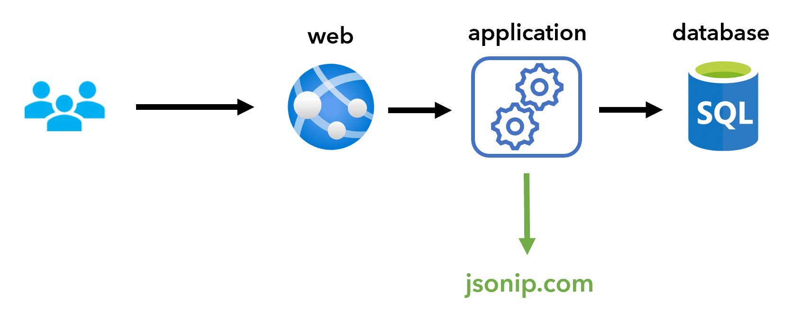
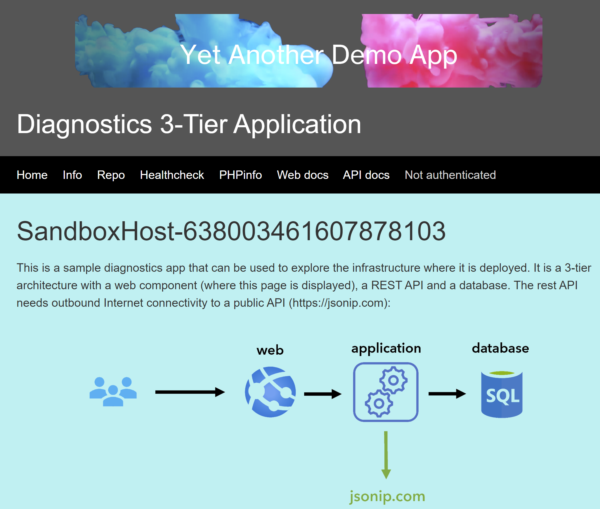

# Yet Another Demo App

This repo contains code for a 3-tier application that can be used to explore workload platforms. Other demo or helloworld apps just show a fancy page, potentially even with some functionality like To Do lists, voting options or even simulating enterprise apps. YADA (Yet Another Demo App) doesn't pretend to be a real application, but instead it will give you diagnostics information that will help you understand the underlying infrastructure, such as:

- IP address (private and public)
- IP address with which the database sees the app tier
- HTTP request headers and cookies
- Instance MetaData Service (IMDS)
- DNS and reverse resolution
- Access between tiers
- Outbound connectivity with curl
- Drive up CPU load to test autoscaling
- Storage benchnmarking

YADA is composed of a web tier and a REST-based application tier that will access a database. The database can be SQL Server, MySQL or Postgres, and no special databases need to be created:

Both the web tier and the application tier will give information about the platform where they are running (hostname, public IP address, IMDS and more). The web tier is customizable with different brandings and background colors. With the default branding and cyan background it looks like this:

Both app and web tiers are containerized and can be deployed in different platforms: Virtual machines with Docker (such as [Flatcar](https://www.flatcar.org/)), Kubernetes, Azure Container Instances, Azure Web Apps or any other container-based architecture.

You can find the images for the web and API tier in these public images in Dockerhub:

- erjosito/yadaweb:1.0
- erjosito/yadaapi:1.0

## Deployment guides

The following files contain instructions to deploy YADA on different platforms:

- [Deploy on Docker containers](./deploy/docker.md)
- [Deploy on public Azure Container Instances](./deploy/ACI_public.md)
- [Deploy on public ACI with TLS on nginx](./deploy/ACI_nginx_sidecar.md)
- [Deploy on Kubernetes](./deploy/k8s.md)
- [Deploy on WebApps](./deploy/webapp.md)
- [Deploy on virtual machines](./deploy/vm.md)

## Contributing

This project welcomes contributions and suggestions.  Most contributions require you to agree to a
Contributor License Agreement (CLA) declaring that you have the right to, and actually do, grant us
the rights to use your contribution. For details, visit https://cla.opensource.microsoft.com.

When you submit a pull request, a CLA bot will automatically determine whether you need to provide
a CLA and decorate the PR appropriately (e.g., status check, comment). Simply follow the instructions
provided by the bot. You will only need to do this once across all repos using our CLA.

This project has adopted the [Microsoft Open Source Code of Conduct](https://opensource.microsoft.com/codeofconduct/).
For more information see the [Code of Conduct FAQ](https://opensource.microsoft.com/codeofconduct/faq/) or
contact [opencode@microsoft.com](mailto:opencode@microsoft.com) with any additional questions or comments.

## Trademarks

This project may contain trademarks or logos for projects, products, or services. Authorized use of Microsoft trademarks or logos is subject to and must follow [Microsoft's Trademark & Brand Guidelines](https://www.microsoft.com/en-us/legal/intellectualproperty/trademarks/usage/general).
Use of Microsoft trademarks or logos in modified versions of this project must not cause confusion or imply Microsoft sponsorship.
Any use of third-party trademarks or logos are subject to those third-party's policies.
